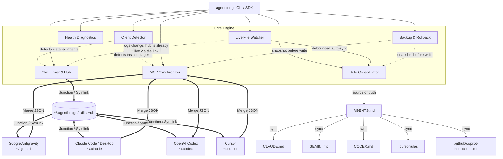

# AgentBridge

[](https://github.com/Helter5/agentbridge/actions/workflows/ci.yml)
[](https://www.npmjs.com/package/agentbridge)
[](https://opensource.org/licenses/MIT)
[](https://www.typescriptlang.org/)
[](https://nodejs.org/)

Universal Skill & MCP Sync Engine for AI Coding Agents.

---

## What does this do?

**Google Antigravity**, **Claude Code**, **OpenAI Codex**, and **Cursor** each keep their own private copy of your custom Skills, MCP servers, and project rules - in different folders, different file formats, none of them aware the others exist. Add a skill or an MCP server to one, and it's invisible to the rest until you copy it over by hand, every time, per agent.

AgentBridge fixes that with one shared hub (`~/.agentbridge/skills`) that every agent's own skills folder links to directly via a native OS symlink/junction - no daemon, no polling, no elevated privileges. Add a skill once, it's instantly available everywhere. MCP servers and project rules (`AGENTS.md` → `CLAUDE.md`/`GEMINI.md`/etc.) get merged and mirrored the same way with a single command instead of four manual edits.

---

## Architecture



`Doctor` reads across the hub and all 4 agents for diagnostics but writes nothing on its own (`--fix` repairs broken links directly via the same cross-platform link helper `SkillLinker` uses, not by calling into `SkillLinker` itself), so it has no outgoing edges above. `SkillLinker`'s own pre-link backup (see `link-skills` below) is a separate mechanism from `Rollback` - that's why no edge connects them.

Key safety properties baked into every write path: automatic pre-write backups (`link-skills`, `sync-mcp`, `sync-rules` - see the Commands section below for exactly which mechanism each uses and how to restore), and secrets are never persisted in plain text if an equivalent OS environment variable already exists (see the Secret Redaction note under `sync-mcp`).

---

## Quick Setup

**Requirements:** Node.js ≥18.0.0.

Run directly without installing, using `npx`:

```bash
npx agentbridge status        # See what's detected - read-only, changes nothing
npx agentbridge link-skills   # Merge skills into the hub, link every agent to it
npx agentbridge sync-mcp      # Merge and mirror MCP servers across agents
npx agentbridge doctor        # Health check
```

Or install globally for a shorter command:

```bash
npm install -g agentbridge
agentbridge status
```

---

## Commands

Most commands accept `--hub <path>` to override the default `~/.agentbridge/skills` hub location.

| # | Command | What it does | Key options |
|---|---|---|---|
| 1 | `status` | Overview: detected agents, skill counts, MCP server counts, hub link status | `--json`, `--hub` |
| 2 | `pick` (alias `import`) | Interactively choose which skills/MCPs to import | `--target`, `--hub` |
| 3 | `link-skills` | Merge existing skills into the hub, link every agent to it | `--dry-run`, `--no-backup`, `-y`, `--hub` |
| 4 | `sync-mcp` | Merge & mirror MCP servers across all agent configs | `--output`, `--dry-run`, `-y` |
| 5 | `sync-rules` | Sync `AGENTS.md` to `CLAUDE.md`/`GEMINI.md`/`CODEX.md`/`.cursorrules`/copilot | `--mode`, `--cwd`, `-y`, `--no-backup` |
| 6 | `add-skill <name>` | Scaffold a new skill directly in the hub | `--desc`, `--tags`, `--author`, `--hub` |
| 7 | `doctor` | Health check: broken links, exposed secrets, name/MCP-server conflicts | `--fix`, `--hub` |
| 8 | `unlink` | Disconnect agents from the hub, restore standalone copies | `--no-restore`, `-y` |
| 9 | `rollback` | List or restore automatic backup snapshots | `--list`, `<snapshot-id>` |
| 10 | `watch` | Live auto-sync for the skills hub and `AGENTS.md` | `--cwd` |

**Common flags** (same meaning everywhere they appear):

| Flag | Meaning |
|---|---|
| `-y`, `--yes` | Skip the confirmation prompt |
| `--dry-run` | Preview what would happen, write nothing to disk |
| `--no-backup` | Skip the automatic pre-write backup for this run |
| `--hub <path>` | Use a different hub directory instead of `~/.agentbridge/skills` |
| `--json` | Machine-readable output instead of the formatted table (`status` only) |

### 1. `agentbridge status`
Scans the system and presents an ASCII table overview of all installed AI coding agents, skills counts, hub linking status, and configured MCP servers.

```bash
agentbridge status
agentbridge status --json    # Output machine-readable JSON
```

### 2. `agentbridge pick` (or `agentbridge import`)
Interactively multiselect which skills, commands, or MCP servers to import into your active environment.

```bash
agentbridge pick
agentbridge pick --target ./my-skills   # Import into a custom directory instead of the default hub
```

### 3. `agentbridge link-skills`
Migrates existing skills into the central hub (`~/.agentbridge/skills`) without data loss, then creates transparent directory junctions (Windows) or symbolic links (macOS/Linux).

```bash
agentbridge link-skills
agentbridge link-skills --dry-run     # Preview actions without modifying disk
agentbridge link-skills --no-backup   # Skip the pre-link snapshot backup
agentbridge link-skills -y            # Skip confirmation prompt
```

> **Note (partial failure):** if linking fails partway through more than one agent, the error names which agent actually failed, which agents were already processed before it (their skills may already be merged into the hub), and recommends running `agentbridge doctor` to check the current state before retrying.

### 4. `agentbridge sync-mcp`
Safely reads MCP server declarations across all detected client configuration files, deep-merges environment variables, command arguments, and server keys, then mirrors them across all agents.

```bash
agentbridge sync-mcp
agentbridge sync-mcp --output ./mcp-unified.json    # Export merged config to standalone file
agentbridge sync-mcp --dry-run                      # Preview the merge without writing to disk
agentbridge sync-mcp -y
```

> **Secret Redaction:** `sync-mcp` never writes a plain-text secret to disk if it doesn't have to. Before writing any agent config, it checks each `env` value against your current OS environment variables - if a value exactly matches one (e.g. `GITHUB_PERSONAL_ACCESS_TOKEN`), it writes `${GITHUB_PERSONAL_ACCESS_TOKEN}` instead of the literal value. Set the variable once:
> ```bash
> # Windows (PowerShell)
> [System.Environment]::SetEnvironmentVariable('GITHUB_PERSONAL_ACCESS_TOKEN', 'your-token', 'User')
> # macOS/Linux - add to your shell profile (~/.zshrc, ~/.bash_profile, ...)
> export GITHUB_PERSONAL_ACCESS_TOKEN=your-token
> ```
> then run `agentbridge sync-mcp` again - any agent's config still holding the literal value gets rewritten to the `${VAR}` reference automatically, no matter how many agents you have. `agentbridge doctor` flags any plain-text secret it finds (with this same fix in its warning text) but never sets an OS environment variable on your behalf - that's a real side effect on your machine only you should trigger, and only you know the right value.

> **MCP Server Conflict Detection:** if two agents independently define a server with the same name but genuinely different `command`, `args`, or an overlapping `env` key with a different value, `sync-mcp` merges them field-by-field - the later-processed agent's value silently wins on the fields that actually conflict (an env key present in only one side isn't a conflict; both survive). `sync-mcp` prints a warning naming the server, which fields disagreed, and which agents disagreed; `agentbridge doctor` reports the same thing as a persistent check ("MCP Server Conflicts") so it shows up even between syncs. Neither auto-resolves it - only you know which agent's definition should actually win. Re-run `sync-mcp` after fixing the losing agent's config directly, or edit the merged result via `sync-mcp --output`.

### 5. `agentbridge sync-rules`
Synchronizes project-level agent rules. Reads `AGENTS.md` as the single source-of-truth and mirrors or symlinks it to `CLAUDE.md`, `GEMINI.md`, `CODEX.md`, `.cursorrules`, and `.github/copilot-instructions.md`.

```bash
agentbridge sync-rules
agentbridge sync-rules --mode symlink    # Create symlinks instead of auto-sync copies
agentbridge sync-rules --cwd ./my-repo
agentbridge sync-rules -y                # Skip confirmation prompt
agentbridge sync-rules --no-backup       # Skip snapshotting existing target files before overwriting
```

> **Note (`--mode symlink` on Windows):** creating a real file symlink requires Developer Mode or an elevated shell. Without either, AgentBridge transparently falls back to a hardlink, which stays in sync when `AGENTS.md` is edited in place but can go stale if it's replaced outright (e.g. some editors' "atomic save" does a delete + rewrite). The CLI output tells you which one you actually got (`Symlinked to source` vs `Hardlinked to source`) - if you see the latter and need true symlinks, enable Developer Mode or run as admin, then re-run the command.

### 6. `agentbridge add-skill <name>`
Scaffolds a new skill directory in the central hub with a standard `SKILL.md` template containing YAML frontmatter.

```bash
agentbridge add-skill database-migration --desc "Automated PostgreSQL schema migration recipes" --tags db,sql,migrations --author "Your Name"
```

### 7. `agentbridge doctor`
Runs health diagnostics: audits plain-text tokens and secrets in MCP configs, detects skill name collisions and same-named MCP servers with conflicting definitions across agents, checks junction integrity, and repairs broken links with `--fix`.

```bash
agentbridge doctor
agentbridge doctor --fix     # Automatically repair broken links and missing folders
```

> **Note (exit codes):** without `--fix`, any warning or error in the report exits `1` (broken links, exposed secrets, and skill-name collisions are all reported at `warning` severity, so this catches them too) - so `agentbridge doctor && deploy` stops before a real problem. With `--fix`, the exit code reflects the repair pass instead and is `0` once it has run.

### 8. `agentbridge unlink`
Safely disconnects agents from the central hub, removing junctions/symlinks and restoring independent directories with copies of hub skills.

```bash
agentbridge unlink
agentbridge unlink --no-restore     # Disconnect without copying hub skills back
agentbridge unlink -y               # Skip confirmation prompt
```

### 9. `agentbridge rollback`
Lists timestamped backup snapshots from `~/.agentbridge/backups/` and restores configurations to an earlier state.

```bash
agentbridge rollback
agentbridge rollback --list                 # List all available snapshots
agentbridge rollback snapshot-1787674932079 # Restore a specific snapshot directly by ID
```

### 10. `agentbridge watch`
Starts a lightweight live file watcher that monitors the central skills hub and workspace `AGENTS.md`, automatically synchronizing changes in real time.

```bash
agentbridge watch
agentbridge watch --cwd ./my-repo   # Watch a specific project root instead of the current directory
```

---

## Supported Agents

| AI Coding Agent | Config Directory | Skills Directory | MCP Config Path | Rules Target |
|---|---|---|---|---|
| **Google Antigravity** | `~/.gemini/config` | `~/.gemini/config/skills` | `mcp_config.json` | `GEMINI.md` |
| **Claude Code** | `~/.claude` | `~/.claude/skills` | `claude_desktop_config.json` | `CLAUDE.md` |
| **OpenAI Codex** | `~/.codex` | `~/.codex/skills` | `config.json` | `CODEX.md` |
| **Cursor** | `~/.cursor` | `~/.cursor/skills` | `mcp.json` | `.cursorrules` |
| — | — | — | — | `.github/copilot-instructions.md` *(GitHub Copilot is a `sync-rules` target only - it isn't skill/MCP-managed like the 4 agents above)* |

---

## Cross-Platform Support

| Operating System | Skills Linking Strategy | Administrator Privileges Required? | Status |
|---|---|---|:---:|
| **macOS** (Apple Silicon / Intel) | POSIX Symbolic Links (`dir`) | No | Supported |
| **Linux** (Ubuntu / Fedora / Arch) | POSIX Symbolic Links (`dir`) | No | Supported |
| **Windows 10 / 11** | NTFS Directory Junctions (`junction`) | No | Supported |

---

## Programmatic TypeScript SDK

You can import and use `agentbridge` directly in Node.js / TypeScript code:

```typescript
import {
  detectInstalledAgents,
  linkAgentsToHub,
  syncMcpConfigs,
  syncProjectRules,
  runDiagnostics,
} from 'agentbridge';

// 1. Detect installed agents
const agents = await detectInstalledAgents();

// 2. Link skills to central hub
const linkSummary = await linkAgentsToHub(agents);

// 3. Mirror MCP configs
const mcpSummary = await syncMcpConfigs(agents);

// 4. Run diagnostics
const report = await runDiagnostics();
```

---

## Development

```bash
# Clone repository
git clone https://github.com/Helter5/agentbridge.git
cd agentbridge

# Install dependencies
npm install

# Run Vitest test suite
npm test

# Run tests with code coverage
npm run test:coverage

# Build TypeScript binary
npm run build

# Run local CLI
node dist/cli.js status
```

---

## License

MIT (c) AgentBridge Contributors
