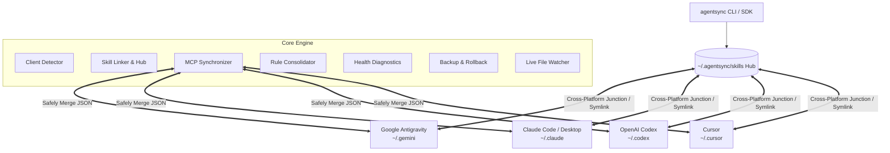

# AgentSync

[](https://github.com/agentsync-dev/agentsync/actions/workflows/ci.yml)
[](https://www.npmjs.com/package/agentsync)
[](https://opensource.org/licenses/MIT)
[](https://www.typescriptlang.org/)
[](https://nodejs.org/)

Universal Skill & MCP Sync Engine for AI Coding Agents.

Unify, link, and mirror custom **Skills**, **Model Context Protocol (MCP) servers**, and **Project Rules** across **Google Antigravity**, **Claude Code**, **OpenAI Codex**, and **Cursor** on macOS, Linux, and Windows.

---

## Overview

AI Coding Agents utilize distinct filesystem hierarchies and configuration specifications:
- **Google Antigravity** stores skills in `~/.gemini/config/skills` and MCP configurations in `mcp_config.json`.
- **Claude Code** manages skills in `~/.claude/skills` and desktop MCP servers in `claude_desktop_config.json`.
- **OpenAI Codex** stores skills in `~/.codex/skills` and configurations in `~/.codex/config.json`.
- **Cursor** configures MCP servers and skills in `~/.cursor/`.

AgentSync standardizes configurations across all environments:
1. **Single Source of Truth**: Establishes a unified hub at `~/.agentsync/skills`.
2. **Cross-Platform Zero-Privilege Linking**: Uses POSIX Symlinks on macOS/Linux and NTFS Directory Junctions on Windows (no elevated Administrator privileges required).
3. **Lossless MCP Server Merging**: Deep-merges environment variables, arguments, and server configs across all client configuration files without clobbering custom agent settings.
4. **Universal Project Rules**: Automatically consolidates and synchronizes `AGENTS.md` to `CLAUDE.md`, `GEMINI.md`, and `.cursorrules`.
5. **Transactional Rollbacks**: Automated snapshot backups before multi-agent synchronization with full restoration on failure.

---

## Architecture



---

## Quickstart

Run directly without global installation using `npx`:

```bash
# Check detected agents, active skills, and MCP servers
npx agentsync status

# Interactively pick and selectively import skills / MCPs
npx agentsync pick

# Merge and link skills across all detected agents
npx agentsync link-skills

# Mirror and synchronize MCP servers across all agent configs
npx agentsync sync-mcp

# Verify symlink integrity, schemas, and permissions
npx agentsync doctor
```

Or install globally:

```bash
npm install -g agentsync
```

---

## CLI Reference

### 1. `agentsync status`
Scans the system and presents an ASCII table overview of all installed AI coding agents, skills counts, hub linking status, and configured MCP servers.

```bash
agentsync status
agentsync status --json    # Output machine-readable JSON
```

### 2. `agentsync pick` (or `agentsync import`)
Interactively multiselect which skills, commands, or MCP servers to import into your active environment.

```bash
agentsync pick
```

### 3. `agentsync link-skills`
Migrates existing skills into the central hub (`~/.agentsync/skills`) without data loss, then creates transparent directory junctions (Windows) or symbolic links (macOS/Linux).

```bash
agentsync link-skills
agentsync link-skills --dry-run     # Preview actions without modifying disk
agentsync link-skills -y            # Skip confirmation prompt
```

### 4. `agentsync sync-mcp`
Safely reads MCP server declarations across all detected client configuration files, deep-merges environment variables, command arguments, and server keys, then mirrors them across all agents.

```bash
agentsync sync-mcp
agentsync sync-mcp --output ./mcp-unified.json    # Export merged config to standalone file
agentsync sync-mcp -y
```

### 5. `agentsync sync-rules`
Synchronizes project-level agent rules. Reads `AGENTS.md` as the single source-of-truth and mirrors or symlinks it to `CLAUDE.md`, `GEMINI.md`, and `.cursorrules`.

```bash
agentsync sync-rules
agentsync sync-rules --mode symlink    # Create symlinks instead of auto-sync copies
agentsync sync-rules --cwd ./my-repo
```

### 6. `agentsync add-skill <name>`
Scaffolds a new skill directory in the central hub with a standard `SKILL.md` template containing YAML frontmatter.

```bash
agentsync add-skill database-migration --desc "Automated PostgreSQL schema migration recipes" --tags db,sql,migrations
```

### 7. `agentsync doctor`
Runs health diagnostics: audits plain-text tokens and secrets in MCP configs, detects skill name collisions, checks junction integrity, and repairs broken links with `--fix`.

```bash
agentsync doctor
agentsync doctor --fix     # Automatically repair broken links and missing folders
```

### 8. `agentsync unlink`
Safely disconnects agents from the central hub, removing junctions/symlinks and restoring independent directories with copies of hub skills.

```bash
agentsync unlink
```

### 9. `agentsync rollback`
Lists timestamped backup snapshots from `~/.agentsync/backups/` and restores configurations to an earlier state.

```bash
agentsync rollback
agentsync rollback --list  # List all available snapshots
```

### 10. `agentsync watch`
Starts a lightweight live file watcher that monitors the central skills hub and workspace `AGENTS.md`, automatically synchronizing changes in real time.

```bash
agentsync watch
```

---

## Supported Agents

| AI Coding Agent | Config Directory | Skills Directory | MCP Config Path | Rules Target |
|---|---|---|---|---|
| **Google Antigravity** | `~/.gemini/config` | `~/.gemini/config/skills` | `mcp_config.json` | `GEMINI.md` |
| **Claude Code** | `~/.claude` | `~/.claude/skills` | `claude_desktop_config.json` | `CLAUDE.md` |
| **OpenAI Codex** | `~/.codex` | `~/.codex/skills` | `config.json` | `CODEX.md` |
| **Cursor** | `~/.cursor` | `~/.cursor/skills` | `mcp.json` | `.cursorrules` |

---

## Cross-Platform Support

| Operating System | Skills Linking Strategy | Administrator Privileges Required? | Status |
|---|---|---|:---:|
| **macOS** (Apple Silicon / Intel) | POSIX Symbolic Links (`dir`) | No | Supported |
| **Linux** (Ubuntu / Fedora / Arch) | POSIX Symbolic Links (`dir`) | No | Supported |
| **Windows 10 / 11** | NTFS Directory Junctions (`junction`) | No | Supported |

---

## Programmatic TypeScript SDK

You can import and use `agentsync` directly in Node.js / TypeScript code:

```typescript
import {
  detectInstalledAgents,
  linkAgentsToHub,
  syncMcpConfigs,
  syncProjectRules,
  runDiagnostics,
} from 'agentsync';

// 1. Detect installed agents
const agents = await detectInstalledAgents();

// 2. Link skills to central hub
const linkSummary = await linkAgentsToHub(agents);

// 3. Mirror MCP configs
const mcpSummary = await syncMcpConfigs(agents);

// 4. Run diagnostics
const report = await runDiagnostics();
```

---

## Development

```bash
# Clone repository
git clone https://github.com/Helter5/agentsync.git
cd agentsync

# Install dependencies
npm install

# Run Vitest test suite
npm test

# Run tests with code coverage
npm run test:coverage

# Build TypeScript binary
npm run build

# Run local CLI
node dist/cli.js status
```

---

## License

MIT (c) AgentSync Contributors
