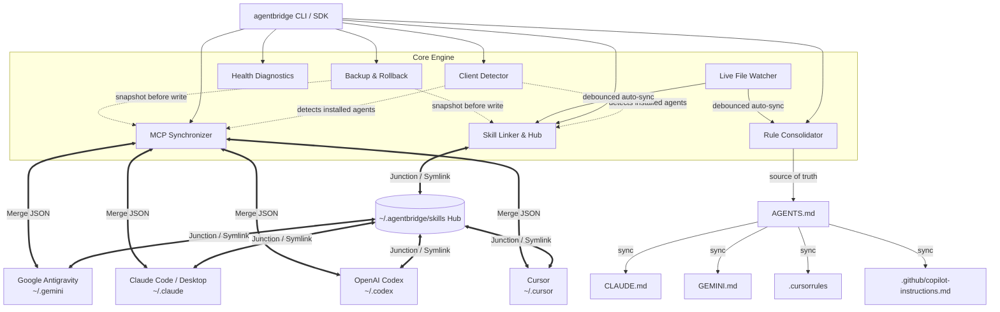

# AgentBridge

[](https://github.com/Helter5/agentbridge/actions/workflows/ci.yml)
[](https://www.npmjs.com/package/agentbridge)
[](https://opensource.org/licenses/MIT)
[](https://www.typescriptlang.org/)
[](https://nodejs.org/)

Universal Skill & MCP Sync Engine for AI Coding Agents.

Unify, link, and mirror custom **Skills**, **Model Context Protocol (MCP) servers**, and **Project Rules** across **Google Antigravity**, **Claude Code**, **OpenAI Codex**, and **Cursor** on macOS, Linux, and Windows.

---

## Overview

AI Coding Agents utilize distinct filesystem hierarchies and configuration specifications:
- **Google Antigravity** stores skills in `~/.gemini/config/skills` and MCP configurations in `mcp_config.json`.
- **Claude Code** manages skills in `~/.claude/skills` and desktop MCP servers in `claude_desktop_config.json`.
- **OpenAI Codex** stores skills in `~/.codex/skills` and configurations in `~/.codex/config.json`.
- **Cursor** configures MCP servers and skills in `~/.cursor/`.

AgentBridge standardizes configurations across all environments:
1. **Single Source of Truth**: Establishes a unified hub at `~/.agentbridge/skills`.
2. **Cross-Platform Zero-Privilege Linking**: Uses POSIX Symlinks on macOS/Linux and NTFS Directory Junctions on Windows (no elevated Administrator privileges required).
3. **Lossless MCP Server Merging**: Deep-merges environment variables, arguments, and server configs across all client configuration files without clobbering custom agent settings.
4. **Universal Project Rules**: Automatically consolidates and synchronizes `AGENTS.md` to `CLAUDE.md`, `GEMINI.md`, `.cursorrules`, and `.github/copilot-instructions.md`.
5. **Transactional Rollbacks**: Automated snapshot backups before multi-agent synchronization with full restoration on failure.

---

## Architecture



`Doctor` reads across the hub and all 4 agents for diagnostics but writes nothing on its own (`--fix` reuses `SkillLinker`), so it has no outgoing edges above.

---

## Quickstart

Run directly without global installation using `npx`:

```bash
# Check detected agents, active skills, and MCP servers
npx agentbridge status

# Interactively pick and selectively import skills / MCPs
npx agentbridge pick

# Merge and link skills across all detected agents
npx agentbridge link-skills

# Mirror and synchronize MCP servers across all agent configs
npx agentbridge sync-mcp

# Verify symlink integrity, schemas, and permissions
npx agentbridge doctor
```

Or install globally:

```bash
npm install -g agentbridge
```

---

## CLI Reference

Most commands (`status`, `pick`, `link-skills`, `sync-mcp`'s output target aside, `add-skill`, `doctor`) accept `--hub <path>` to override the default `~/.agentbridge/skills` hub location.

### 1. `agentbridge status`
Scans the system and presents an ASCII table overview of all installed AI coding agents, skills counts, hub linking status, and configured MCP servers.

```bash
agentbridge status
agentbridge status --json    # Output machine-readable JSON
```

### 2. `agentbridge pick` (or `agentbridge import`)
Interactively multiselect which skills, commands, or MCP servers to import into your active environment.

```bash
agentbridge pick
agentbridge pick --target ./my-skills   # Import into a custom directory instead of the default hub
```

### 3. `agentbridge link-skills`
Migrates existing skills into the central hub (`~/.agentbridge/skills`) without data loss, then creates transparent directory junctions (Windows) or symbolic links (macOS/Linux).

```bash
agentbridge link-skills
agentbridge link-skills --dry-run     # Preview actions without modifying disk
agentbridge link-skills --no-backup   # Skip the pre-link snapshot backup
agentbridge link-skills -y            # Skip confirmation prompt
```

> **Note (partial failure):** if linking fails partway through more than one agent, the error names which agent actually failed, which agents were already processed before it (their skills may already be merged into the hub), and recommends running `agentbridge doctor` to check the current state before retrying.

### 4. `agentbridge sync-mcp`
Safely reads MCP server declarations across all detected client configuration files, deep-merges environment variables, command arguments, and server keys, then mirrors them across all agents.

```bash
agentbridge sync-mcp
agentbridge sync-mcp --output ./mcp-unified.json    # Export merged config to standalone file
agentbridge sync-mcp --dry-run                      # Preview the merge without writing to disk
agentbridge sync-mcp -y
```

### 5. `agentbridge sync-rules`
Synchronizes project-level agent rules. Reads `AGENTS.md` as the single source-of-truth and mirrors or symlinks it to `CLAUDE.md`, `GEMINI.md`, `.cursorrules`, and `.github/copilot-instructions.md`.

```bash
agentbridge sync-rules
agentbridge sync-rules --mode symlink    # Create symlinks instead of auto-sync copies
agentbridge sync-rules --cwd ./my-repo
agentbridge sync-rules -y                # Skip confirmation prompt
```

> **Note (`--mode symlink` on Windows):** creating a real file symlink requires Developer Mode or an elevated shell. Without either, AgentBridge transparently falls back to a hardlink, which stays in sync when `AGENTS.md` is edited in place but can go stale if it's replaced outright (e.g. some editors' "atomic save" does a delete + rewrite). The CLI output tells you which one you actually got (`Symlinked to source` vs `Hardlinked to source`) - if you see the latter and need true symlinks, enable Developer Mode or run as admin, then re-run the command.

### 6. `agentbridge add-skill <name>`
Scaffolds a new skill directory in the central hub with a standard `SKILL.md` template containing YAML frontmatter.

```bash
agentbridge add-skill database-migration --desc "Automated PostgreSQL schema migration recipes" --tags db,sql,migrations --author "Your Name"
```

### 7. `agentbridge doctor`
Runs health diagnostics: audits plain-text tokens and secrets in MCP configs, detects skill name collisions, checks junction integrity, and repairs broken links with `--fix`.

```bash
agentbridge doctor
agentbridge doctor --fix     # Automatically repair broken links and missing folders
```

> **Note (exit codes):** without `--fix`, any warning or error in the report exits `1` (broken links, exposed secrets, and skill-name collisions are all reported at `warning` severity, so this catches them too) - so `agentbridge doctor && deploy` stops before a real problem. With `--fix`, the exit code reflects the repair pass instead and is `0` once it has run.

### 8. `agentbridge unlink`
Safely disconnects agents from the central hub, removing junctions/symlinks and restoring independent directories with copies of hub skills.

```bash
agentbridge unlink
agentbridge unlink --no-restore     # Disconnect without copying hub skills back
agentbridge unlink -y               # Skip confirmation prompt
```

### 9. `agentbridge rollback`
Lists timestamped backup snapshots from `~/.agentbridge/backups/` and restores configurations to an earlier state.

```bash
agentbridge rollback
agentbridge rollback --list                 # List all available snapshots
agentbridge rollback snapshot-1787674932079 # Restore a specific snapshot directly by ID
```

### 10. `agentbridge watch`
Starts a lightweight live file watcher that monitors the central skills hub and workspace `AGENTS.md`, automatically synchronizing changes in real time.

```bash
agentbridge watch
agentbridge watch --cwd ./my-repo   # Watch a specific project root instead of the current directory
```

---

## Supported Agents

| AI Coding Agent | Config Directory | Skills Directory | MCP Config Path | Rules Target |
|---|---|---|---|---|
| **Google Antigravity** | `~/.gemini/config` | `~/.gemini/config/skills` | `mcp_config.json` | `GEMINI.md` |
| **Claude Code** | `~/.claude` | `~/.claude/skills` | `claude_desktop_config.json` | `CLAUDE.md` |
| **OpenAI Codex** | `~/.codex` | `~/.codex/skills` | `config.json` | — *(not a `sync-rules` target yet)* |
| **Cursor** | `~/.cursor` | `~/.cursor/skills` | `mcp.json` | `.cursorrules` |
| — | — | — | — | `.github/copilot-instructions.md` *(GitHub Copilot is a `sync-rules` target only - it isn't skill/MCP-managed like the 4 agents above)* |

---

## Cross-Platform Support

| Operating System | Skills Linking Strategy | Administrator Privileges Required? | Status |
|---|---|---|:---:|
| **macOS** (Apple Silicon / Intel) | POSIX Symbolic Links (`dir`) | No | Supported |
| **Linux** (Ubuntu / Fedora / Arch) | POSIX Symbolic Links (`dir`) | No | Supported |
| **Windows 10 / 11** | NTFS Directory Junctions (`junction`) | No | Supported |

---

## Programmatic TypeScript SDK

You can import and use `agentbridge` directly in Node.js / TypeScript code:

```typescript
import {
  detectInstalledAgents,
  linkAgentsToHub,
  syncMcpConfigs,
  syncProjectRules,
  runDiagnostics,
} from 'agentbridge';

// 1. Detect installed agents
const agents = await detectInstalledAgents();

// 2. Link skills to central hub
const linkSummary = await linkAgentsToHub(agents);

// 3. Mirror MCP configs
const mcpSummary = await syncMcpConfigs(agents);

// 4. Run diagnostics
const report = await runDiagnostics();
```

---

## Development

```bash
# Clone repository
git clone https://github.com/Helter5/agentbridge.git
cd agentbridge

# Install dependencies
npm install

# Run Vitest test suite
npm test

# Run tests with code coverage
npm run test:coverage

# Build TypeScript binary
npm run build

# Run local CLI
node dist/cli.js status
```

---

## License

MIT (c) AgentBridge Contributors
